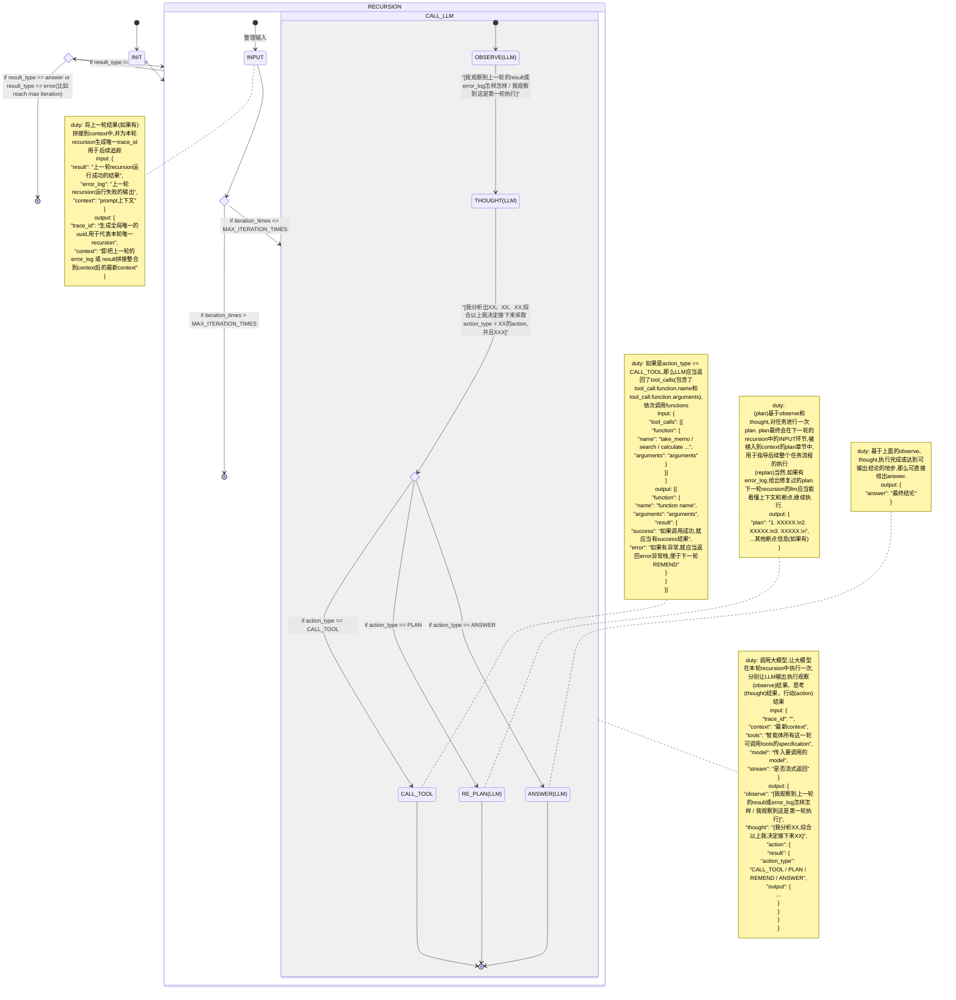

## 总览
我们要实现的是一套递归智能体ReAct机制：用户输入需求，智能体基于手中现有的tools / functions，通过递归，自行去plan到执行，甚至可以自行纠错，直到任务完成。

## ReAct机制状态机

## 系统特性要求

- recursion要有可回溯性（有task_id、step_id、trace_id），前端到时候有地方可以读取一个基于task_id的完整回溯查询能力，甚至有机遇agent_id的每轮task_id（其实每轮task可能就是一轮对话）的查询能力。
- 不用去管旧的preview chat接口，重新写个新的chat stream接口，应当实时向前端暴露出plan了什么、recursion在执行什么、plan的step消灭了哪些等实时必要信息。
- agent的定义应当增加max_iteration字段配置，默认值是30。agent已经定义了大模型选型，那么面向这个agent去chat的时候整个ReAct状态机（包括recursion）都应当用这个大模型作为执行底座。
- 切记为了避免message / context / prompt递归爆炸，所以应当是message[0]是role = user的用户原始输入需求，message[1]是role = system的system prompt（模板我已经提前写好了你可以读取进来），其中的`{{current_state}}`就是每轮recursion变化过后的实时状态快照，而message[2 - n]是role = assistant的ReAct每轮recursion返回的result（或error），这样就能避免随着recursion的递归增加整个messages重复出现大量system prompt导致信息爆炸。
